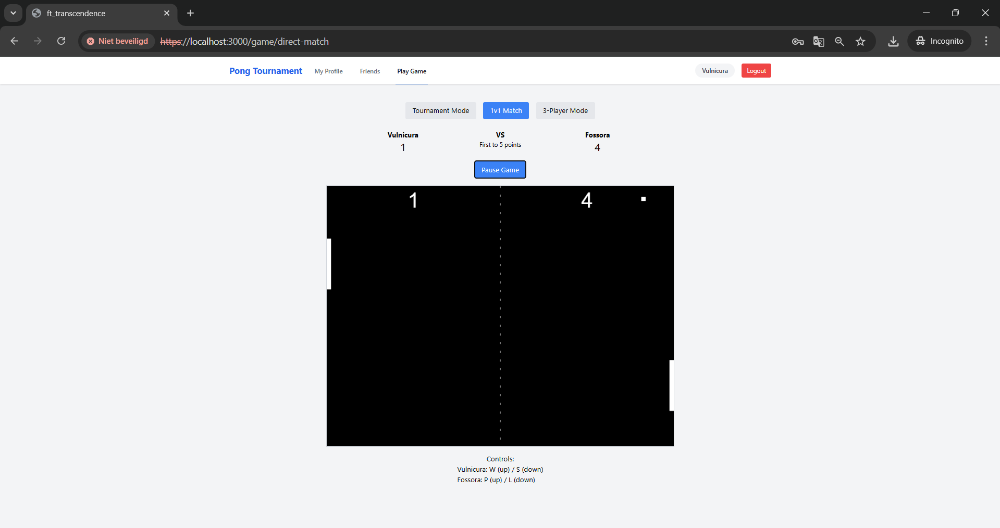
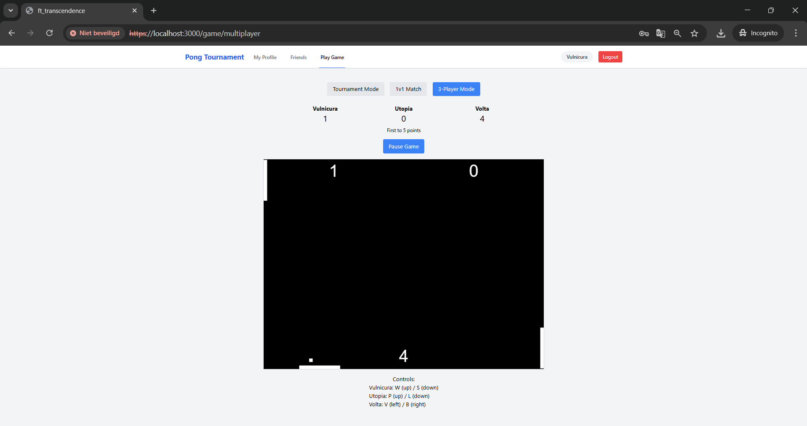
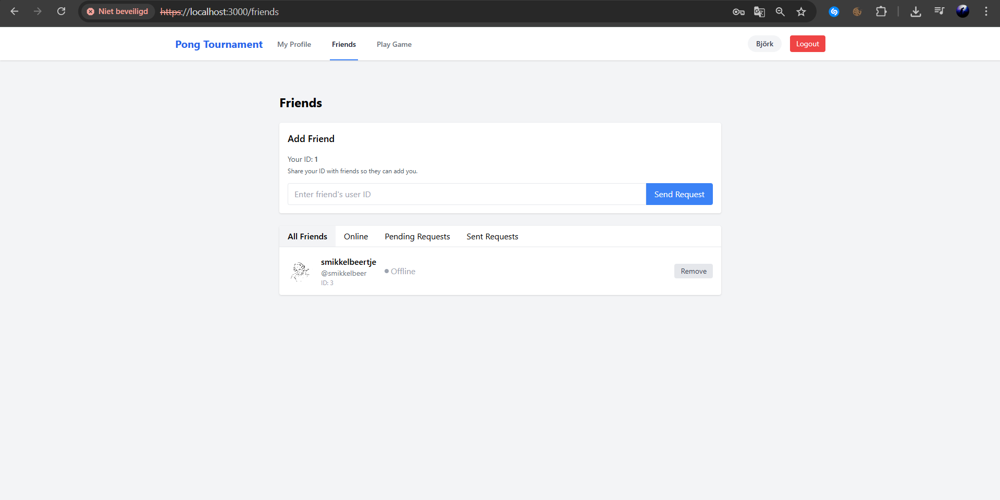

# ft_transcendence: Modern Web-based Pong Game Platform

## 🎮 Project Overview

ft_transcendence is a modern web-based Pong game platform that brings the classic arcade experience to life with real-time multiplayer capabilities, tournaments, and social features. Built with Node.js, TypeScript, and containerized with Docker, this project demonstrates web development skills, real-time communication implementation, and secure user management.

## ✨ Features

- **Classic Pong Gameplay**: Faithful recreation of the original Pong (1972)
- **Tournament System**: Organize and participate in competitive tournaments
- **Multiplayer Modes**:
  - Direct 1v1 matches (local or remote)
  - 3-Player unique gameplay on specialized boards
- **User Management**: Register, log in, customize profiles
- **Social Features**: Friends list, online status tracking
- **Game Stats**: Comprehensive match history and performance analytics

## 🛠️ Technical Stack

### Backend
- **Framework**: Fastify with Node.js
- **Database**: SQLite for data persistence
- **Authentication**: JWT tokens with optional 2FA security
- **Security**: HTTPS, password hashing, XSS protection

### Frontend
- **Languages**: TypeScript with Tailwind CSS
- **Architecture**: Single-page application
- **Responsive Design**: Support for various devices and screen sizes

### Deployment
- **Containerization**: Docker for consistent deployment
- **One-command Setup**: Simple launch with docker-compose

## 🚀 Getting Started

### Prerequisites
- Docker and Docker Compose installed
- Modern web browser (Firefox recommended)

### Installation
```bash
# Clone the repository
git clone https://github.com/yourusername/ft_transcendence.git
cd ft_transcendence

# Configure environment
cp .env.example .env
# Edit .env with your configuration

# Launch the application
docker-compose up --build
```

Access the application at: https://localhost

## 📷 Screenshots

<div align="center">
  
  
  
  
  
  
</div>

## 🎮 Game Modes

### Direct Match
Challenge a friend to a classic 1-on-1 Pong match with customizable settings.

### Tournament Mode
Create or join tournaments with multiple players, automatic matchmaking, and progressive rounds leading to a championship match.

### 3-Player Multiplayer
Experience a unique twist on Pong with three players simultaneously controlling paddles on different sides of the playing field.

## 🕹️ Controls

- **Movement**: WASD keys or arrow keys
- **Game Options**: Access via in-game menu
- **Tournament Navigation**: On-screen buttons for match progression

## 🔐 Security Features

- Password hashing for secure storage
- Protection against SQL injections and XSS attacks
- HTTPS connections for all communications
- Form validation on both client and server sides
- Optional Two-Factor Authentication

## 📚 Project Structure

```
ft_transcendence/
├── backend/                 # Server-side code
│   ├── src/                 # Source files
│   │   ├── config/          # Configuration
│   │   ├── controllers/     # Request handlers
│   │   ├── models/          # Data models
│   │   ├── plugins/         # Fastify plugins
│   │   ├── routes/          # API endpoints
│   │   └── services/        # Business logic
│   └── Dockerfile           # Backend container definition
├── frontend/                # Client-side code
│   ├── public/              # Static assets
│   ├── src/                 # Source files
│   │   ├── components/      # UI components
│   │   ├── context/         # React context
│   │   └── services/        # API services
│   └── Dockerfile           # Frontend container definition
├── docker/                  # Docker configuration
│   └── nginx/               # Web server configuration
├── docker-compose.yml       # Service orchestration
└── README.md                # This file
```

## 📄 License

Distributed under the MIT License. See `LICENSE` for more information.

## 👥 Authors

- [Jared Goedhart](https://github.com/jaredgoedhart)
- [Luca Goddijn](https://github.com/DontCallMeLuca)

## 🙏 Acknowledgments

The 42 Network for the project inspiration.
The Pong game (1972) for the classic gameplay concept.
The open-source community for the tools and libraries used.

This project was developed as part of the 42 School curriculum.
