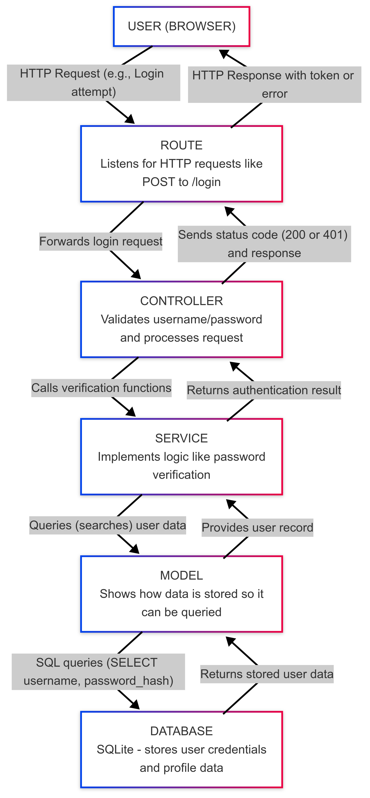

# 1.0 Backend Framework Implementation

---
## Overview

The backend of this project is built using **Fastify**, a high-performance Node.js framework. A Node.js framework is a set of tools and libraries that help you quickly and efficiently build server-side applications in Node.js.

## Example Of A Server-side Application

Imagine you're building a website where users can log in and view their profiles. The server-side part of this application handles requests like:

- Checking if the user's login credentials are correct.


- Fetching the user's data from a database.


- Sending that data back to the browser.

For this, you would use a Node.js framework like **Fastify** to help manage the routes, handle requests, and easily interact with a database.

## Why Use The Module? 

Using a Node.js framework like **Fastify** makes this process easier by providing pre-built functions and tools to handle common tasks, so you don't have to write everything from scratch. It helps you structure your code, manage HTTP requests, and interact with databases in a much cleaner and faster way.

---

## Backend Architecture

The backend is structured with a clear separation of concerns, making it easy to understand and maintain:

```
Backend
├── config        # Configuration of the SQLite database
├── controllers   # Request handlers that process user input (e.g., login)
├── models        # Defines how the user's data is organized and stored in the database
├── plugins       # Adds Fastify plugins to the server
├── routes        # Defines routes (API endpoints) for HTTP requests (e.g., "POST", "GET")
├── services      # Implements the functionality for specific tasks (e.g., managing friends)
└── types         # Adds type definitions of external modules to TypeScript
```
---

## What’s An API?

An **API** (Application Programming Interface) allows different software systems to communicate with each other.

Before diving into APIs, let's first clarify what an **interface** is. An interface is simply a point of interaction between two systems or components. In the case of a **User Interface (UI)**, it's the part of the application you interact with as a user (e.g., buttons, menus, and forms).

An **API** is similar, but instead of interacting directly with a visual interface, you interact with the application through a **programming interface**. It’s the “behind-the-scenes” part of an application.

The term **API** makes more sense when you compare it to a **User Interface (UI)**. If the UI is the visual part of the application that you interact with, then the API is like the programmatic interface.

### Real-Life Comparisons:

The concept of an API can be found everywhere in daily life:

- **Car keys (UI)** → actually starting the engine (API)
- **Restaurant menu (UI)** → the entire process of how that food is then brought to you (API)
- **Clicking on a YouTube video** → the actual video being fetched from a server and sent to you (API)

### The Nervous System Of An Application

An **API** is the entire process of communication between systems, which is not visible to the user. It allows different applications to talk to each other, acting as the "nervous system" of the application.

It works by providing efficient routes for data to travel quickly and smoothly. Think of it as the backbone of the application, handling communication, requests, and responses.

---

## How It Works Together

When a user interacts with the application (like clicking "Login"), here's what happens behind the scenes:

**1. The Route receives the user's request (e.g., login attempt)**
- The Route (API endpoint) listens for specific requests (like a POST to /login).
- When an HTTP request hits the API endpoint, it triggers the Controller.

**2. The Route passes the request to the appropriate Controller**
- The Controller handles the request and processes the logic associated with the API endpoint.

**3. The Controller validates the input and calls the relevant Service**
- The Controller checks if the data (like the username or password) is valid.
- If valid, it calls the Service to perform the core functionality (e.g., checking the password).

**4. The Service performs the functionality (e.g., checking password) using Models**
- The Service interacts with the Models to perform operations like querying (searching) the database or performing business logic (e.g., verifying if the password matches the stored one).

**5. The result flows back through the chain to respond to the user**
- Once the Service completes its task, it sends the result back to the Controller.
- The Controller prepares the response and includes an appropriate HTTP status code (e.g., 200 for success or 400 for error).
- The Controller sends the response back to the Route, which then sends it to the user.

## The Restaurant Example

Think of your application like a restaurant:

- **Frontend (UI)**: The user interface is everything the user interacts with—like the seats, menu, and cutlery in a restaurant.
- **Backend**: The backend is where data is processed. In this analogy, it’s the kitchen, where the food is prepared based on the menu.
- **Database**: The database stores all the data securely. In the restaurant example, it's the storage room where the ingredients are kept safely. You want the storage room to be clean and secure to prevent contamination, like mold, bacteria, or water damage—just like in your database. If your ingredients (data) aren’t stored properly, it can lead to poor quality or even dangerous results.
- **API**: The API connects everything together, enabling smooth communication. It’s like the route in a restaurant: the waiter (API) delivers orders (data) between the kitchen (backend) and the customer (frontend), ensuring the right ingredients (data) are used and the meal (response) is delivered properly.

So, the **ingredients (data)** are retrieved from the **storage room (database)**, prepared in the **kitchen (backend)**, carried by the **waiter (controller)**, and delivered to the **user (frontend)**. This route must be fast and efficient to ensure that everything stays fresh and safe, just like data should be securely processed and transferred through the API.


## Visual Representation



The diagram illustrates the request flow through the application:
- Blue boxes represent server components
- Gray arrows show the data flow direction
- Each layer has a specific responsibility
- Requests flow down through the layers, and responses flow back up

---


## Key Plugins Used:

- **JWT Plugin**: Secures user logins by creating and verifying special tokens
    - When users log in, they receive a token (like a digital ID card)
    - This token is checked on protected pages to verify the user's identity


- **CORS Plugin**: Allows the website to talk to the server
    - Without this, your browser would block communication for security reasons
    - It's like giving permission for specific websites to access the server


- **WebSocket Plugin**: Enables instant updates without refreshing the page
    - Used for features like showing when friends come online
    - Similar to how messaging apps update instantly when you receive a message


- **Static Plugin**: Delivers files like images to the browser
    - Handles serving user profile pictures
    - Works like a file delivery service


- **Multipart Plugin**: Processes file uploads
    - Handles when users upload profile pictures
    - Breaks down large files into manageable pieces

---

## Plugin Registration

Adding new functionality to Fastify is done through plugins. Here's how plugins are registered in the application:

### Create a Plugin File
- Create a new file in the `plugins` directory.
- Example: `my_plugin.ts` for a new feature.

### Write the Plugin Code
- Import the required dependencies.
- Define the plugin functionality.
- Export the plugin as a default function.

### Register in `index.ts`
- Import the plugin at the top of `index.ts`.
- Add the plugin to the server using `await server.register(my_plugin)`.
- The server will now have the new functionality available.

This plugin system makes the application modular and maintainable – each feature is isolated in its own plugin file, keeping the codebase organized and easy to update.

---

## API Organization

The API endpoints are organized like a highway system with different exits for different destinations:

Each "exit" (route path) leads to a specific feature area, making it easy to find what you need:

* `/api/auth/*` - **Authentication endpoints**
    * Where users register accounts and log in
    * Like the entrance gates to a secure building


* `/api/user/*` - **User profile endpoints**
    * For viewing and updating personal information
    * Similar to the roads leading to your personal mailbox


* `/api/friends/*` - **Friend management endpoints**
    * For sending and accepting friend requests
    * Like the paths connecting different houses in a neighborhood


* `/api/matches/*` - **Game data endpoints**
    * For storing and retrieving game history and statistics
    * Similar to the scoreboard area in a sports arena


* `/api/2fa/*` - **Security endpoints**
    * Handles two-factor authentication for extra account protection
    * Like adding a second lock to your front door


* `/api/gdpr/*` - **Privacy endpoints**
    * For managing personal data and privacy settings
    * Similar to the records office where you can view or remove your information
---

## Basic Route Example

Here's a simple example of a route implementation:

```typescript
/* In routes/user_routes.ts */
async function user_routes(fastify: FastifyInstance): Promise<void> 
{
    /* Protected route that requires authentication */
    fastify.register(async (protected_routes: FastifyInstance) => 
    {
        /* Add authentication middleware */
        protected_routes.addHook("onRequest", (request, reply, done) => 
        {
            fastify.authenticate(request, reply, done);
        });

        /* GET user profile endpoint */
        protected_routes.get("/profile", (request, reply) => 
        {
            user_controller.get_profile(request, reply);
        });
            
    }, { prefix: "/api/user" });
}
```

---

## Security Flow

The backend implements a layered security approach to protect user data and ensure secure interactions:

1. **Request Validation**
    - Ensures that incoming data is properly formatted and meets required standards.
    - It's like checking the contents of a package before shipping it.
    - _(Done in the Controller, where the request body and parameters are validated before passing to the Service.)_


2. **Authentication**
    - Verifies the user's identity using JWT (JSON Web Tokens).
    - This is similar to showing an ID card to prove who you are.
    - _(Done in the Authentication Service, where JWT tokens are created and verified during login and protected route access.)_


3. **Authorization**
    - Confirms that the user has permission to perform the requested action.
    - Like checking if someone has the correct access pass to enter a restricted area.
    - _(Done in the Controller or Service, where the user's permissions are checked before proceeding with the requested action.)_


4. **Business Logic**
    - Processes the request securely, ensuring no vulnerabilities are exposed.
    - This is where the core functionality, like checking credentials or handling data, happens safely.
    - _(Done in the Service, where the core application logic is implemented and securely processes data.)_


5. **Response Filtering**
    - Removes any sensitive data from the response before sending it back to the user.
    - It's like wiping off any confidential information from a report before it’s handed over.
    - _(Done in the Controller or Route, where the response is prepared and sensitive information is filtered out before sending it to the user.)_

---

## Database Integration

The application uses **SQLite** for data storage with a simple structure:

- **Models**
    - Define the structure of the data (e.g., tables and fields).

- **Services**
    - Handle all database operations (e.g., adding, updating, or fetching data).

- **Controllers**
    - Never interact directly with the database; they use Services to get and send data.

With Models and Services separated, you can switch databases (e.g., from SQLite to MySQL) without changing other parts of the app.

---

## Environment Configuration

The backend uses environment variables to configure different aspects of the application:

- **DATABASE_PATH**: Path to the SQLite database file
- **JWT_SECRET**: Secret key used for generating secure tokens
- **CORS_ORIGIN**: Allowed origins for cross-origin requests
- **PORT**: The port number the server runs on

Environment variables are loaded from a `.env` file using the `dotenv` package, making it easy to change configuration without modifying code. _The frontend also has a .env file located at "frontend/"._

---

## Error Handling

The application uses a consistent error handling approach:

1. **Validation Errors**
    - **Status**: 400
    - **Example**: Invalid email format
    - _(Handled in the Controller, where input is validated before processing.)_


2. **Authentication Errors**
    - **Status**: 401
    - **Example**: Incorrect password
    - _(Handled in the Authentication Service, where credentials are verified.)_


3. **Permission Errors**
    - **Status**: 403
    - **Example**: User trying to access a restricted page
    - _(Handled in the Controller or Service, where user permissions are checked.)_


4. **Resource Errors**
    - **Status**: 404
    - **Example**: User profile not found
    - _(Handled in the Service, where the requested resource is searched for.)_


5. **Server Errors**
    - **Status**: 500
    - **Example**: Database connection failure
    - _(Handled by the server, which returns a generic error response for internal issues.)_
